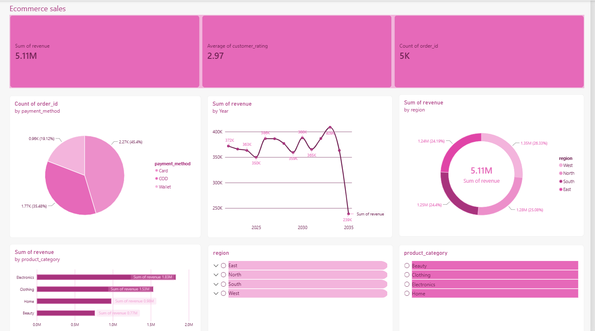

# E-commerce Sales Dashboard

An interactive **Power BI** dashboard that analyzes 5,000 online store orders: revenue, payment methods, product categories, regions, and customer ratings.

> ℹ️ **About the data:** this is a **synthetic practice dataset**, created for learning data analysis and dashboard design. It is not real sales data from a company.

---

## 📊 What the dashboard shows

| Visual | What it answers |
|---|---|
| **KPI cards** | Total revenue, average customer rating, and number of orders |
| **Orders by payment method** | How customers prefer to pay |
| **Revenue by year** | How sales change over time |
| **Revenue by region** | Which regions bring the most revenue |
| **Revenue by product category** | Which products sell the most |
| **Region & category filters** | Explore the data for any region or category |

---

## 💡 Key insights

- **Revenue:** 5,000 orders generated **5.11M** in revenue.
- **Payment:** most customers pay by **card** (45%), then **cash on delivery** (35%). **Wallet** is the least used (19%).
- **Products:** **Electronics** is the best-selling category (1.83M), and **Beauty** is the lowest (0.77M).
- **Regions:** revenue is **evenly spread** across the four regions, with **West** slightly ahead (1.35M).
- **Customer rating:** the average is **2.97 out of 5**, so customer satisfaction is low.
- **Over time:** revenue stays **stable** from year to year.

> ⚠️ The drop in **2035** is not a real decline. The dataset only covers **January to September** of that year.

---

## 🛠️ Tools

- **Power BI Desktop:** data modeling, visuals, and filters
- **CSV:** the source data

---

## 📁 Files

| File | Description |
|---|---|
| `sales (2).pbix` | The Power BI dashboard file (open it with Power BI Desktop) |
| `Dashboard.png` | A screenshot of the dashboard |
| `ecommerce_sales_analytics_5000.csv` | The dataset (5,000 orders, 12 columns) |

### Dataset columns
`order_id` · `order_date` · `customer_id` · `product_category` · `region` · `quantity` · `unit_price` · `discount` · `payment_method` · `delivery_days` · `customer_rating` · `revenue`

---

## 🚀 How to open it

1. Download [Power BI Desktop](https://powerbi.microsoft.com/desktop/) (free, Windows only)
2. Download `sales (2).pbix` from this repository
3. Open it in Power BI Desktop and use the filters to explore

No Power BI? See the screenshot above.

---

📂 More of my work: [github.com/DataScientist0](https://github.com/DataScientist0)
